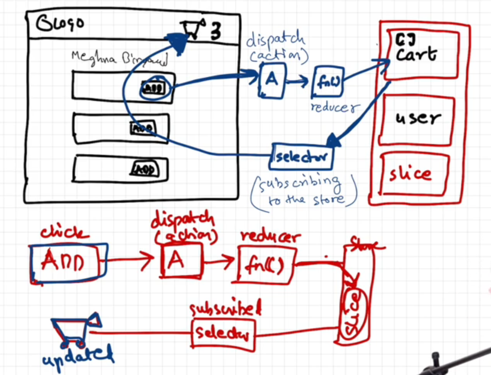

# Episode 12 - Let's Build Our Store

### Redux

- Redux is not mandatory in most of application.(use it only if it required).
- Do not use if your application is small or mid size.
- React and Redux are different libraries.
- They offers easy debugging.

#### Two Libraries :-

- React-Redux
- Redux-Toolkit

##### Uses

- To handle large amount of data.

### Redux Toolkit

- It is standard way to write Redux logic. It help to address three common conerns about redux.
- Configuring a redux store is too complicated
- I have to add a lot of packages to get redux to do anything useful.
- Redux requries too much boilerplate code.

### Redux Store

- Its js object that kept in global/central place.
- It have slices which divide store in multiple part.
- example from our app

#### workflow

- When you click on Add button, it DISPATCH a ACTION. That call ACTION then REDUCER function will modifies cart.(write)
- SELECTOR(Subscribing to the store) read data from stor and SELECTOR will modifies cart in header.

### Redux Toolkit - App flowchart



### Algorithm

- Install @reduxjs/toolkit and react-redux
- Build out store
- Connect out store to our app
- Slice (CartSlice)
- Dispatch(action)
- Selector

difference between

```
onClick={handleAddItem}
```

```
onClick={() => handleAddItem(item)}
```

```
onClick={handleAddItem(item)}
```

- reducer - used in store
- reducers - used in slice

## for documentation purpose :

- /tutorials/rtk-query
